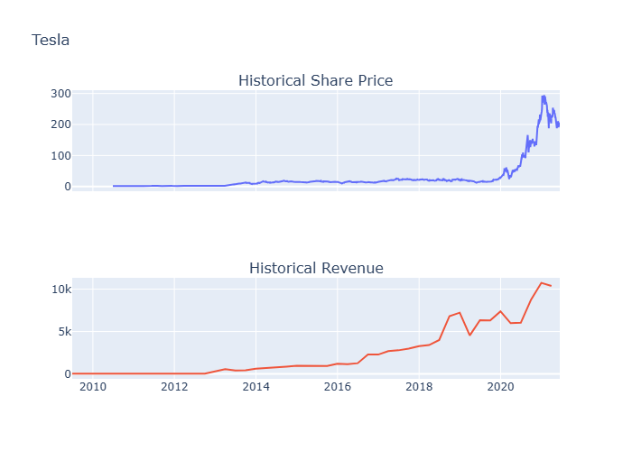
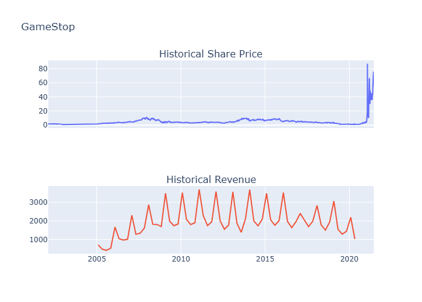

# Stock Performance Analysis — Extraction, Scraping & Dashboard

An end-to-end financial data analysis project that combines API-based data retrieval and web scraping to extract, process, and visualize historical stock price and revenue data for major publicly traded companies.

---

## Project Notebooks

| Notebook | Focus |
|----------|-------|
| [`01_stock_data_extraction.ipynb`](01_stock_data_extraction.ipynb) | Extracting stock metadata, price history, and dividends using the `yfinance` API |
| [`02_web_scraping.ipynb`](02_web_scraping.ipynb) | Scraping historical stock price tables from web pages using BeautifulSoup |
| [`03_stock_dashboard.ipynb`](03_stock_dashboard.ipynb) | Full pipeline: combining both techniques to build interactive price vs revenue dashboards |

---

## Key Questions Explored

- How has Apple's stock price trended over its full trading history, and how have dividend payments grown?
- How does `yfinance` compare to web scraping as a data extraction method for financial analysis?
- Does Tesla's stock price growth reflect its underlying revenue growth?
- How did GameStop's 2021 short squeeze compare to its actual business revenue — and what does that tell us about market sentiment?

---

## Dashboard Previews

| Stock | Dashboard |
|-------|-----------|
| Tesla |  |
| GameStop |  |

---

## Key Findings

- **Apple's long-term growth:** AAPL's price chart shows sustained appreciation with dramatic acceleration post-2019, supported by consistent dividend growth since 2012.
- **Tesla — fundamentals-driven:** Tesla's stock price rise closely tracks its revenue growth, making it a strong example of price reflecting improving business performance.
- **GameStop — sentiment vs fundamentals:** GME's revenue was in long-term decline, yet its stock price spiked explosively in early 2021 due to a Reddit-driven short squeeze — a textbook case of market sentiment decoupling from reality.
- **API vs scraping:** `yfinance` provides clean, structured data instantly, while BeautifulSoup scraping is essential for data sources without an API — both are valuable tools in a financial analyst's toolkit.

---

## Stocks Covered

| Stock | Ticker | Data Source |
|-------|--------|-------------|
| Apple | AAPL | yfinance API |
| AMD | AMD | yfinance API |
| Netflix | NFLX | Web Scraping |
| Amazon | AMZN | Web Scraping |
| Tesla | TSLA | yfinance API + Web Scraping |
| GameStop | GME | yfinance API + Web Scraping |

---

## Technologies Used

- **Python 3.8+**
- `yfinance` — Yahoo Finance API for stock data
- `requests` + `BeautifulSoup` — Web scraping
- `pandas` — Data manipulation and cleaning
- `plotly` — Interactive dashboards
- `matplotlib` — Static price charts
- `kaleido` — Static image export for Plotly charts

---

## Getting Started

```bash
# Clone the repository
git clone https://github.com/JomolJudit/stock-data-analysis.git
cd stock-data-analysis

# Install dependencies
pip install yfinance requests bs4 pandas plotly matplotlib kaleido

# Launch Jupyter
jupyter notebook
```

Place `apple.json` and `amd.json` in the same folder as the notebooks before running Notebook 1.

---

## Concepts Demonstrated

- REST API data retrieval with `yfinance`
- HTML parsing and table extraction with BeautifulSoup
- Data cleaning (currency symbols, null handling, type casting)
- Multi-source data pipeline construction
- Time-series visualization with Matplotlib and Plotly
- Interactive dual-panel financial dashboards
